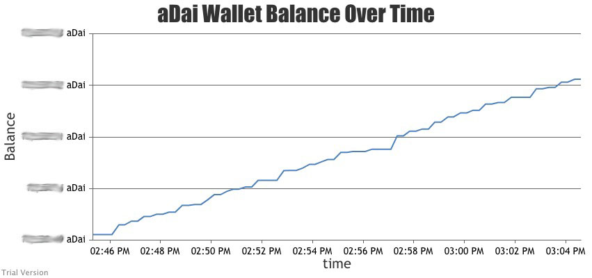
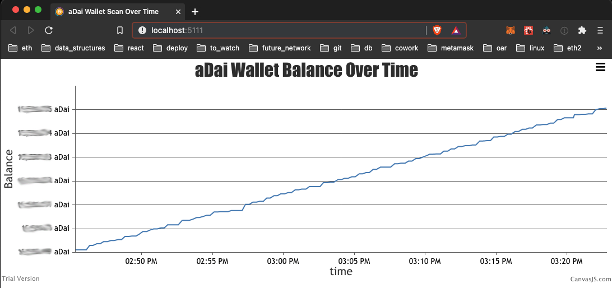

# aDai Wallet Balance Timeline Display



This project allows you to to view your aDai (Aave interest bearing token: https://aave.com/aTokens/) wallet balance over time.

It runs in the browswer as a node/react application that connects with metamask to interact with the web3 aDai smart contract.

It runs locally, there are two parts -- a server, that just stores persistant data, and a react browser frontend. 

## requirements
* https://www.npmjs.com/get-npm
* https://metamask.io/download.html
* Aave Dai deposit https://aave.com/

## How to run

#### Server
From root/json_server:
````
npm install -g json-server
json-server --watch db.json --port 5112 
````
This will run the json server on port 5112. Everytime the client queries data from the smart contract, it will save the balance and time here.

#### Client
From root/adai_scan:
````
npm i @metamask/detect-provider
npm i web3
npm i canvasjs

npm start
````

* If it doesn't open automatically navigate to http://localhost:5111/
* Confirm metamask wallet connection with the address you want to view
* The graph should start to populate with current aDai balance
* Queries every 15 seconds and updates in real time



**Note\* This will not show the balance of all time for your account. It can only show data _you_ have queried with this tool. Queries will only happen while you have the page open. Data _will_ be presistent though thanks to the server so anytime you run it and revist later that data will still be shown**
